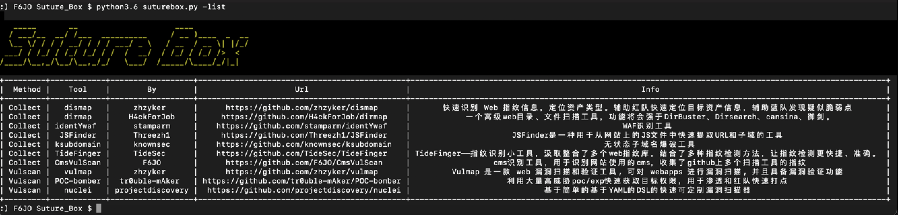
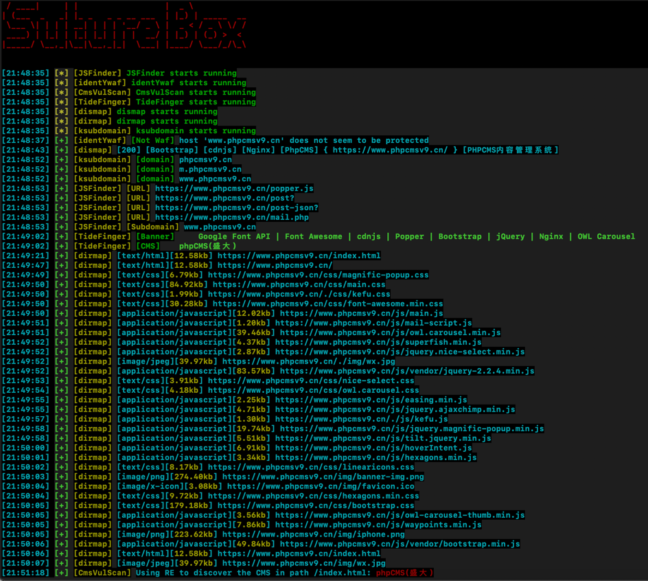
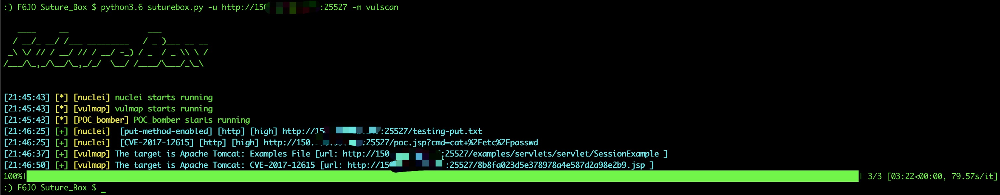

# Suture_Box
集合渗透测试常用工具对目标进行一键扫描的缝合怪

***

## Features:
* 集合了多个github优秀的开源工具，只需传入目标，即可启动收集的工具同时对目标进行扫描，将结果统一格式化输出。现有两个模块的工具：collect（信息收集）与vulscan（漏洞扫描）
* 包含功能：目录扫描、子域名爆破、指纹识别、Cms识别、Waf识别、Js检测url、漏洞扫描

## Collect Tools
* zhzyker/dismap https://github.com/zhzyker/dismap   
  * 快速识别 Web 指纹信息，定位资产类型。辅助红队快速定位目标资产信息，辅助蓝队发现疑似脆弱点
* H4ckForJob/dirmap https://github.com/H4ckForJob/dirmap 
  * 一个高级web目录、文件扫描工具，功能将会强于DirBuster、Dirsearch、cansina、御剑。
* stamparm/identYwaf https://github.com/stamparm/identYwaf 
  * WAF识别工具
* Threezh1/JSFinder https://github.com/Threezh1/JSFinder 
  * JSFinder是一种用于从网站上的JS文件中快速提取URL和子域的工具
* knownsec/ksubdomain https://github.com/knownsec/ksubdomain 
  * 无状态子域名爆破工具
* TideSec/TideFinger https://github.com/TideSec/TideFinger 
  * TideFinger——指纹识别小工具，汲取整合了多个web指纹库，结合了多种指纹检测方法，让指纹检测更快捷、准确。
* F6JO/CmsVulScan https://github.com/F6JO/CmsVulScan 
  * cms识别工具，用于识别网站使用的cms，收集了github上多个扫描工具的指纹

## Vulscan Tools
* zhzyker/vulmap  https://github.com/zhzyker/vulmap 
  * Vulmap 是一款 web 漏洞扫描和验证工具, 可对 webapps 进行漏洞扫描, 并且具备漏洞验证功能
* tr0uble-mAker/POC-bomber https://github.com/tr0uble-mAker/POC-bomber 
  * 利用大量高威胁poc/exp快速获取目标权限，用于渗透和红队快速打点
* projectdiscovery/nuclei https://github.com/projectdiscovery/nuclei 
  * 基于简单的基于YAML的DSL的快速可定制漏洞扫描器。

## Configure（NO.1!）
* 使用前先使用-d下载需要的工具，-p指定代理。目前-p的代理只用于下载工具


## Tool_help:
```
Suture_Box

target:
  -u TARGET             指定url，如：http://www.baidu.com

modular:
  -m MODULAR            设置调用的模块，vulscan(漏洞扫描)/collect(信息收集)，默认信息收集
  -t TOOL               指定单个调用的工具,如: -t vulmap，默认 all 全部调用
  -x EXCLUDE            设置排除调用的工具,使用逗号隔开，如: -x vulmap,dismap

download:
  -d DOWN               要下载的工具或者模块，如 -d vulscan 或 -d vulmap 或 -d all
  -p PROXY              设置代理，格式: 127.0.0.1:7890

other:
  -o OUTPUT_FILE        指定保存路径
  -single               设定此参数后将依次运行工具，而不是同时运行
  -info                 设定是否打印info信息，默认关闭
  -list                 打印所有集成的工具信息
```


## Usage:
```
# 下载所有工具：
python3 suturebox.py -p 127.0.0.1 -d all

# 下载vulscan模块的所有工具：
python3 suturebox.py -p 127.0.0.1 -d vulscan

# 下载vulmap工具：
python3 suturebox.py -p 127.0.0.1 -d vulmap

# 启用vulscan模块下所有工具：
python3 suturebox.py -u https://127.0.0.1 -m vulscan

# 启用vulscan模块下的vulmap工具：
python3 suturebox.py -u https://127.0.0.1 -m vulscan -t vulmap

# 启用vulscan模块下除vulmap和nuclei之外的所有工具：
python3 suturebox.py -u https://127.0.0.1 -m vulscan -x vulmap,nuclei

# 依次启用vulscan模块下除vulmap和nuclei之外的所有工具，并打印调试信息：
python3 suturebox.py -u https://127.0.0.1 -m vulscan -x vulmap,nuclei -info -single
```

### Image:




### Update
* 2022-03-03 增加进度条显示
* 2022-04-21 修改配置文件生成方式为自动生成、更新帮助模块
* 2022-04-24 修改工具为在线下载

### Last words
* 有问题或建议欢迎提交Issues