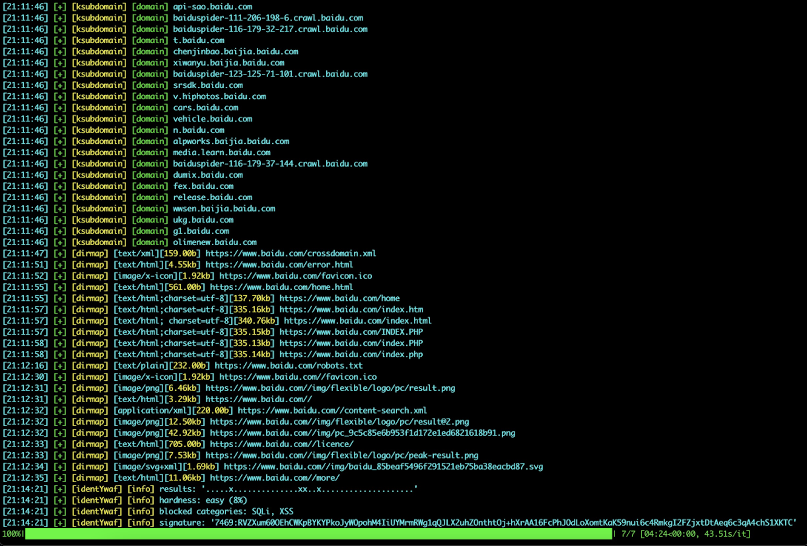
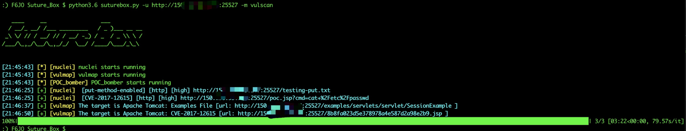

# Suture_Box
集合渗透测试常用工具对目标进行一键扫描的缝合怪

***

## Features:
* 集合了多个github优秀的开源工具，只需传入目标，即可启动收集的工具同时对目标进行扫描，将结果统一格式化输出。现有两个模块的工具：collect（信息收集）与vulscan（漏洞扫描）
* 包含功能：目录扫描、子域名爆破、指纹识别、Cms识别、Waf识别、Js检测url、漏洞扫描

## Collect Tools
* zhzyker/dismap https://github.com/zhzyker/dismap   快速识别 Web 指纹信息，定位资产类型。辅助红队快速定位目标资产信息，辅助蓝队发现疑似脆弱点
* H4ckForJob/dirmap https://github.com/H4ckForJob/dirmap 一个高级web目录、文件扫描工具，功能将会强于DirBuster、Dirsearch、cansina、御剑。
* stamparm/identYwaf https://github.com/stamparm/identYwaf WAF识别工具
* Threezh1/JSFinder https://github.com/Threezh1/JSFinder JSFinder是一种用于从网站上的JS文件中快速提取URL和子域的工具
* knownsec/ksubdomain https://github.com/knownsec/ksubdomain 无状态子域名爆破工具
* TideSec/TideFinger https://github.com/TideSec/TideFinger TideFinger——指纹识别小工具，汲取整合了多个web指纹库，结合了多种指纹检测方法，让指纹检测更快捷、准确。
* F6JO/CmsVulScan https://github.com/F6JO/CmsVulScan cms识别工具，用于识别网站使用的cms，收集了github上多个扫描工具的指纹

## Vulscan Tools
* zhzyker/vulmap  https://github.com/zhzyker/vulmap Vulmap 是一款 web 漏洞扫描和验证工具, 可对 webapps 进行漏洞扫描, 并且具备漏洞验证功能
* tr0uble-mAker/POC-bomber https://github.com/tr0uble-mAker/POC-bomber 利用大量高威胁poc/exp快速获取目标权限，用于渗透和红队快速打点
* projectdiscovery/nuclei https://github.com/projectdiscovery/nuclei 基于简单的基于YAML的DSL的快速可定制漏洞扫描器。

## Configure（NO.1!）
* 1、打开tools/config.ini中（windows打开config-win.ini）
* 2、修改 start_mode 的中配置为命令行中调用python3的方式，如 python或python3


## Tool_help:
```
optional arguments:
  -h, --help      show this help message and exit
  -u TARGET       指定url，如：http://www.baidu.com
  -m MOUDE        设置调用的模块，vulscan(漏洞扫描)/collect(信息收集)，默认信息收集
  -t TOOL         指定单个调用的工具,如: -t vulmap，默认 all 全部调用
  -o OUTPUT_FILE  指定保存路径
  -x EXCLUDE      设置排除调用的工具,使用逗号隔开，如: -x vulmap,dismap
  -single         设定此参数后将依次运行工具，而不是同时运行
  -info           设定是否打印info信息，默认关闭
```


## Usage:
```
python3 -m pip install -r requirements.txt
python3 suturebox.py -u https://xxx.xxx.xxx/ -m vulscan
python3 suturebox.py -u https://xxx.xxx.xxx/ -m vulscan -t vulmap
python3 suturebox.py -u https://xxx.xxx.xxx/ -m vulscan -x vulmap,nuclei
```

### Image:




### Update
* 2022-03-03 增加进度条显示
* 2022-04-21 修改配置文件生成方式为自动生成
### Last words
* 集成的工具有点多，整个项目太大，后面会改成在线下载
* bug也有点多，后面也会改，或者直接上docker
* 以上两条有时间会做的！