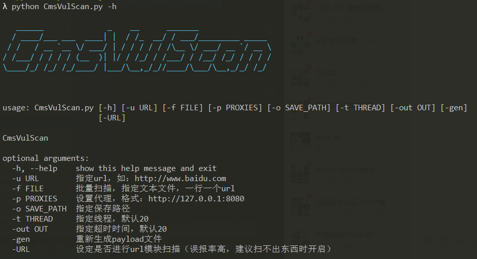
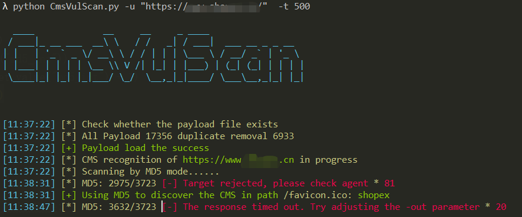
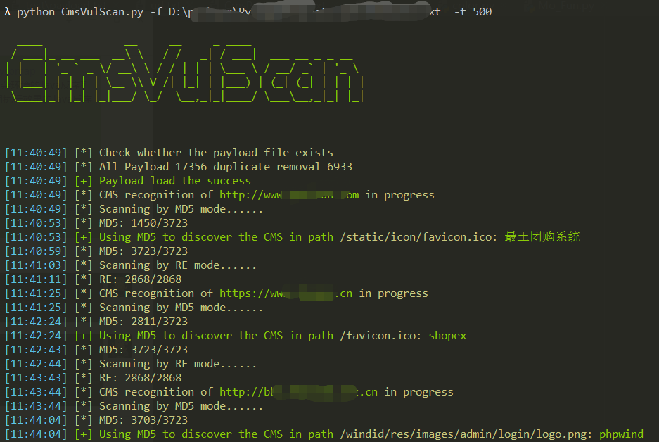
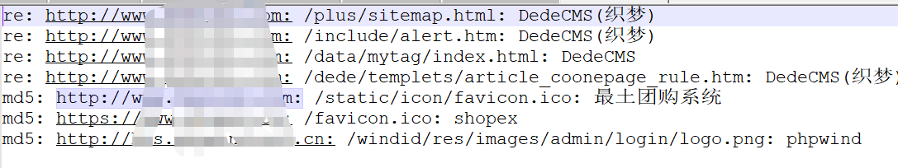

# CmsVulScan

* Cms扫描器，集合了github上大部分payload
* 18000 +指纹库 json格式 MD5+正则+url匹配
* python >=3.5
* python 线程池

***

### 工具说明

* Cms扫描器，用于识别网站使用的cms，后面有时间的话会加入poc模块

* 工具集合了大部分 github 上的开源 cms 扫描工具的 payload 和匹配规则，使用md5、url、正则进行匹配识别

### 依赖库

* requests==2.25.1

* threadpool==1.3.2

### 更新说明

* 增加进度条显示
* 优化报错内容显示

### 使用

* pip install -r requirements.txt
* python CmsVulScan.py -u http://xxx.com
* python CmsVulScan.py -u http://xxx.com -t 200
* python CmsVulScan.py -f url.txt -t 200 -o results.txt

### 参数

* -h, --help    		查看帮助
* -u URL               指定url，如：http://www.baidu.com
* -f FILE               批量扫描，指定文本文件，一行一个url
* -p PROXIES      设置代理，格式：http://127.0.0.1:8080
* -o SAVE_PATH  指定保存路径
* -t THREAD         指定线程，默认20
* -out OUT            指定超时时间，默认20
* -gen                   重新生成payload文件
* -URL                 设定是否进行url模块扫描（误报率高，建议扫不出东西时开启）

### 工具截图

* 
* 
* 
* 

## 警告
***
### 请勿用于非法用途！否则自行承担一切后果
